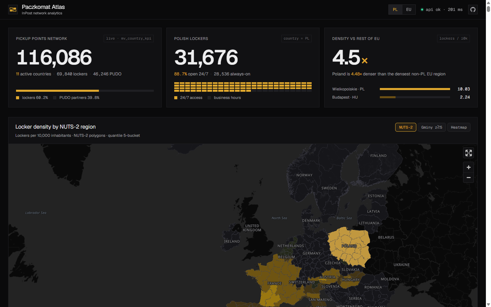
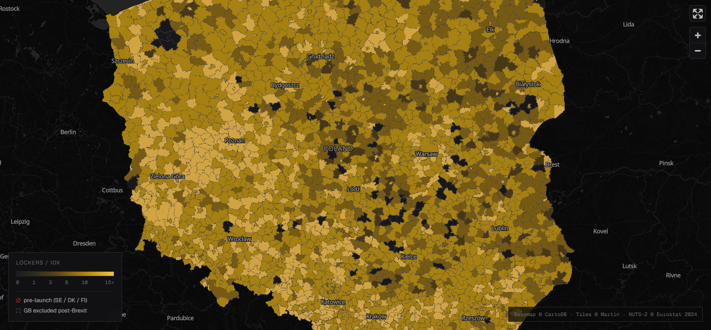

# Paczkomat Atlas

Single-page analytics on InPost's pickup point network across 14 EU markets. Density per 10,000 inhabitants is the analytical lens — it reframes raw counts as a question about access equity. Built in 4 days as a submission to the InPost Technology Internship 2026.

**Live demo:** http://62.238.7.125



👉 **Want the story behind the build? Read [JOURNEY.md](./JOURNEY.md) →**

---

## What it does

The headline finding lives at the top of the dashboard and only emerges once you do the math: the top 15 NUTS-2 regions in the EU by locker density are all Polish voivodeships. Wielkopolskie at **10.03 lockers per 10k inhabitants** is **4.5× denser** than the densest non-PL region, Budapest at 2.24. Every other map in the dashboard exists to support, contextualize, or relativize that single fact.

The density map has three modes. **NUTS-2** paints regional access across the EU — Poland a solid amber block, the rest of the continent in low-saturation greys. **Gminy z≥5** drops down to the 2,477 Polish municipalities, where you can see internal variance (rural Wielkopolskie outperforming urban Mazowsze on a per-10k basis). **Heatmap** abandons the per-capita normalization and just shows physical point density — Berlin, Paris, and Warsaw light up as expected, but so does the Polish countryside in a way no other European country matches.



The country composition strip splits each country into two stacked bars: **owned lockers** vs **PUDO partners**. Germany emerges as a tell — 17,200 PUDO points, 0 native parcel machines. That's the Mondial Relay acquisition footprint, not an organic InPost build-out. The Polish gminy deep-dive table lets a curious reader pivot from continental view to a specific municipality (search for "Warszawa", filter by voivodeship, sort by density) in under five seconds.

## Quickstart

```bash
git clone https://github.com/Niki-3D/paczkomat-atlas.git
cd paczkomat-atlas
cp infra/compose/.env.production.example .env

# Edit .env and set passwords; or run scripts/deploy.sh which generates them
# with openssl rand -base64 32.

docker compose -f infra/compose/docker-compose.yml --env-file .env up -d
# Wait ~30 seconds for db healthcheck.

curl http://localhost:8080/api/v1/health
# {"status":"ok","db":"ok","martin":"ok","locker_count":...}

# Initial data load (~5 min for InPost API crawl, ~10 min for full PRG + Eurostat + BDL):
docker compose -f infra/compose/docker-compose.yml --env-file .env exec api \
    uv run python -m paczkomat_atlas_api.ingest.cli --all

# Then in another terminal:
cd web && pnpm install && pnpm dev
open http://localhost:3000
```

Full production deploy runbook (TLS, least-privilege DB role, PRG loader): [docs/DEPLOY.md](./docs/DEPLOY.md).

## The stack

| Layer | Choice | Why |
|---|---|---|
| Database | Postgres 16 + TimescaleDB + PostGIS + h3 + pgvector (single image) | One pool, one backup target, cross-extension queries (spatial join + h3 aggregation in same MV) without federation |
| Migrations | Alembic | Standard, autogenerate, explicit `include_object` filter for system schemas |
| API | FastAPI + SQLAlchemy 2.0 async + Pydantic v2 | Type-safe end-to-end, auto OpenAPI, declarative `operation_id` per route |
| Pooling | pgbouncer 1.23 (transaction mode) | Caps DB connections under HTTP burst; URL auto-detects and disables prepared-statement cache |
| Tiles | Martin 0.16 | Vector tiles directly from SQL functions marked `IMMUTABLE PARALLEL SAFE STRICT` |
| Frontend | Next.js 16 App Router + React 19 + Tailwind v4 | Server Components, no API-key plumbing in client bundle |
| Map | MapLibre GL JS 5 + OpenFreeMap vector tiles | Free, no key, English labels via `coalesce(name:en, name)` |
| Charts | Recharts v3 + custom div bars | Right tool per chart — Recharts for timeline, hand-rolled CSS grid for share/density bars |
| Table | TanStack Table v8 | Headless, full control over filters and sorting |
| Type-safe client | hey-api codegen from OpenAPI | No drift between API and frontend |
| Edge | Caddy 2.8 (Alpine) | Automatic TLS + security headers + reverse proxy |
| Workflow | Claude Code + 9 `.claude/rules/*.md` + 3 review agents | Enforced conventions across 18 PRs |

## Architecture

```
InPost public API ─┐
Eurostat NUTS-2 ───┼──→ Python ingest ──→ Postgres (TimescaleDB+PostGIS+h3+pgvector)
GUS BDL population ┤                          │
PRG gminy ─────────┘                          ├──→ Martin (vector tiles) ──┐
                                              └──→ FastAPI (KPIs / JSON)  ─┼──→ Caddy ──→ Browser
                                                                            │
                                                         Next.js (SSR) ────┘
```

Cold path: daily ingest writes raw rows into `lockers`, `gminy`, `nuts2`, `population_gmina`, `population_nuts2`; spatial joins fill `gmina_teryt` and `nuts2_id`; pg_cron refreshes four materialized views (`mv_country_kpi`, `mv_density_gmina`, `mv_density_nuts2`, `mv_h3_density_r8`) at 03:00 Europe/Warsaw.

Hot path: Caddy terminates TLS on 443, proxies `/api/*` to FastAPI:8000, `/tiles/*` to Martin:3000, everything else to Next.js:3000. The frontend renders server-side reading from `api:8000` over the internal docker network (a separate `INTERNAL_API_BASE_URL` env var keeps SSR fetches off the public NAT loopback — see [JOURNEY.md](./JOURNEY.md) for the bug story). Browser bundle uses the public hostname.

Six security headers on every response: `X-Content-Type-Options`, `X-Frame-Options: DENY`, `Referrer-Policy: strict-origin-when-cross-origin`, `Strict-Transport-Security`, `Permissions-Policy`, and a CSP that explicitly allows OpenFreeMap tile/font origins and CartoCDN basemap fallbacks.

## Data sources

**InPost public API** at `api-global-points.easypack24.net/v1/points` — 150,603 raw records across 14 active markets, paginated 1000 per page. The status enum has five values (`Operating`, `Created`, `Disabled`, `Overloaded`, `NonOperating`); the dashboard counts `Operating` and `Overloaded` as live. Test fixtures are filtered out at ingest via three rules: `province in ('test','TEST')` (PL convention), `name matches /^DGM.*TEST/i` (IT convention), and `lat == 0 AND lng == 0` (null island, ~5.6% of GB records).

**Eurostat NUTS-2 boundaries** 2024 vintage — 299 polygons in EPSG:4326. GB is excluded post-Brexit; 24,155 GB lockers therefore have `nuts2_id = NULL` and are excluded from the regional density map. SE/DK/FI render as pre-launch because all records in those markets are `Created` or `Disabled` — none `Operating`.

**GUS BDL 2024 population** + **PRG 2022-06-27 gminy boundaries**. BDL doesn't return TERYT codes, so the loader joins on `(voivodeship_code, normalized_name, rodzaj_digit)` against PRG (which carries authoritative TERYT in `JPT_KOD_JE`). After two refinements — a Polish-aware diacritic translate table for `ł/ą/ć/ę/ń/ó/ś/ź/ż` (NFKD doesn't decompose them) and a name-only fallback for *miasta na prawach powiatu* like Warszawa — match rate landed at **99.96%** (2,476 of 2,477 gminy). The single miss is Słupia (Jędrzejowska), parenthesized name. See [JOURNEY.md](./JOURNEY.md) for the archaeology.

## API tour

```bash
# Network summary
curl -s http://62.238.7.125/api/v1/kpi/summary | jq
# {"data":{"n_network_total":116086,"n_lockers_total":69840,"n_pudo_total":46246,
#          "n_countries_active":11,"pl_lockers":31676,"pl_pct_247":88.7},...}

# Top 3 NUTS-2 by density
curl -s "http://62.238.7.125/api/v1/density/nuts2/top?limit=3" | jq '.data | map({c:.country, r:.name_latn, d:.lockers_per_10k})'
# [
#   {"c":"PL","r":"Wielkopolskie","d":10.03},
#   {"c":"PL","r":"Lubuskie",     "d": 9.85},
#   {"c":"PL","r":"Małopolskie",  "d": 9.46}
# ]

# Country breakdown — note DE: 0 lockers, 17,200 PUDO
curl -s http://62.238.7.125/api/v1/kpi/countries | jq '.data | sort_by(-.n_total) | .[0:5] | map({c:.country, lockers:.n_lockers, pudo:.n_pudo})'

# Polish gminy leaderboard
curl -s "http://62.238.7.125/api/v1/density/gminy/top?limit=5" | jq
# Top: Kuślin 19.62, Rudziniec 17.59, Manowo 17.58, ...

# Vector tile (binary MVT) — Poland at zoom 6
curl -sI "http://62.238.7.125/tiles/nuts2_density_tiles/6/35/21"
```

## Known limitations

- **GB excluded from NUTS-2.** Eurostat dropped UK post-Brexit. 24,155 GB lockers have null `nuts2_id`. Future fix: add ONS ITL boundaries as a supplementary source.
- **SE/DK/FI rendered as pre-launch.** Catalog records exist but zero are operational. Honest disclosure beats inflating coverage.
- **PRG vintage is 2022-06-27.** Boundaries for newly-created or merged micro-gminy may differ from current state.
- **Velocity timeline from press releases.** 22 data points across 5 markets, marked `source: press_release` in the schema. TimescaleDB continuous aggregates replace this once ~6 months of daily snapshots accumulate.
- **OpenFreeMap as basemap provider.** Third-party SPOF for labels and topography. Self-hosted PMTiles on Cloudflare R2 is documented but not built.
- **1 / 2,477 gminy unmatched.** Słupia (Jędrzejowska) — parenthesized name defeats the normalization. 99.96% match accepted.
- **HTTP-only live URL.** Let's Encrypt needs a domain; submission demos via raw IP. TLS provisions automatically once DNS lands.
- **Daily MV refresh cadence.** `mv_density_*` refresh at 03:00 Europe/Warsaw via pg_cron. Trigger-based real-time invalidation was out of scope for v1.

## What I'd build next

1. TimescaleDB continuous aggregates for velocity once 6 months of daily snapshots accumulate
2. Backups → Cloudflare R2 wired into pg_cron (currently documented but manual)
3. PMTiles self-hosted instead of OpenFreeMap dependency
4. ONS ITL boundaries for GB equivalent to Eurostat NUTS-2
5. Sentry + Grafana Cloud for production observability
6. CSV / Parquet export endpoints for the data the dashboard surfaces
7. Property-based testing (Hypothesis) for spatial joins at country borders
8. Caddy rebuild via xcaddy with `mholt/caddy-ratelimit` (wiring in place, image swap pending)

## License

MIT.

## Contact

Nikodem Brożyniak — [nbrozyniak@gmail.com](mailto:nbrozyniak@gmail.com) · [github.com/Niki-3D](https://github.com/Niki-3D)
